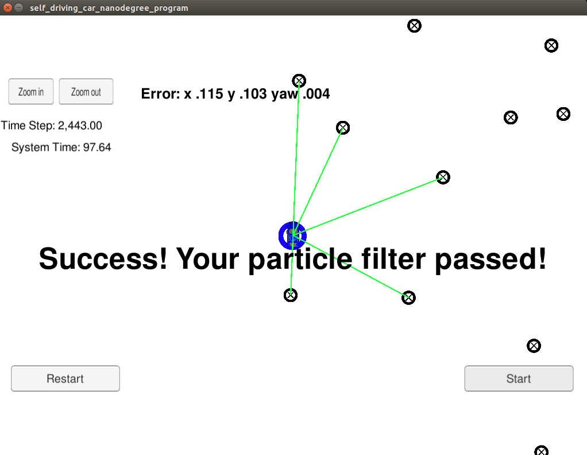
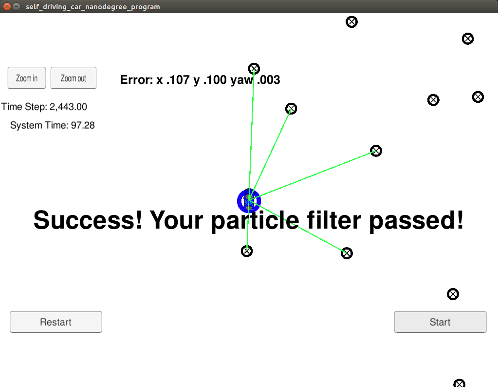

# Particle Filter Project - Kidnapped Vehicle

# Overview
This repository contains all the code implemented for the Localization course in Udacity's Self-Driving Car Nanodegree.

## Submission
A completed version of 2 dimensional `particle_filter.cpp` [particle_filter.cpp](./src/particle_filter.cpp) was implemented in C++ and is located in the [./src](./src/) directory. The filter operates with a map, some initial localization information (GPS), observation and control data at each time step.

## Running the Code
This project involves the Term 2 Simulator which can be downloaded [here](https://github.com/udacity/self-driving-car-sim/releases)

This repository includes two files that can be used to set up and install uWebSocketIO for either Linux or Mac systems. For windows you can use either Docker, VMware, or even Windows 10 Bash on Ubuntu to install uWebSocketIO.

## Compiling and executing the project code

1. mkdir build
2. cd build
3. cmake ..
4. make
5. ./particle_filter

Alternatively, some scripts have been included to streamline this process, these can be leveraged by executing the following in the top directory of the project:

1. ./clean.sh
2. ./build.sh
3. ./run.sh

Tips for setting up your environment can be found [here](https://classroom.udacity.com/nanodegrees/nd013/parts/40f38239-66b6-46ec-ae68-03afd8a601c8/modules/0949fca6-b379-42af-a919-ee50aa304e6a/lessons/f758c44c-5e40-4e01-93b5-1a82aa4e044f/concepts/23d376c7-0195-4276-bdf0-e02f1f3c665d)

## Test results
Following is the final state of simulation after running a filter with 15 particles. The default number of particles used in the code is 15.

 

Following is the final state of simulation after running a filter with 120 particles.

 

Following is the final state of simulation after running a filter with 480 particles.

It can be seen from above that the position and heading errors are getting consistently smaller as the number of particles used increases. However, a large number of particles would significantly slow down the filter at run time. For example, when the filter was tested with 960 particles, it failed the execution time limit of 100 seconds.

## [Rubric](https://review.udacity.com/#!/rubrics/747/view) points

1. **Accuracy**: The particle filter has localized vehicle position and yaw to within the values specified by the automatic grader.

2. **Performance**: The particle filter has completed execution within the time of 100 seconds (tested with number of particles up to 480).

3. **General**: The code has implemented a particle filter to localize the vehicle.

